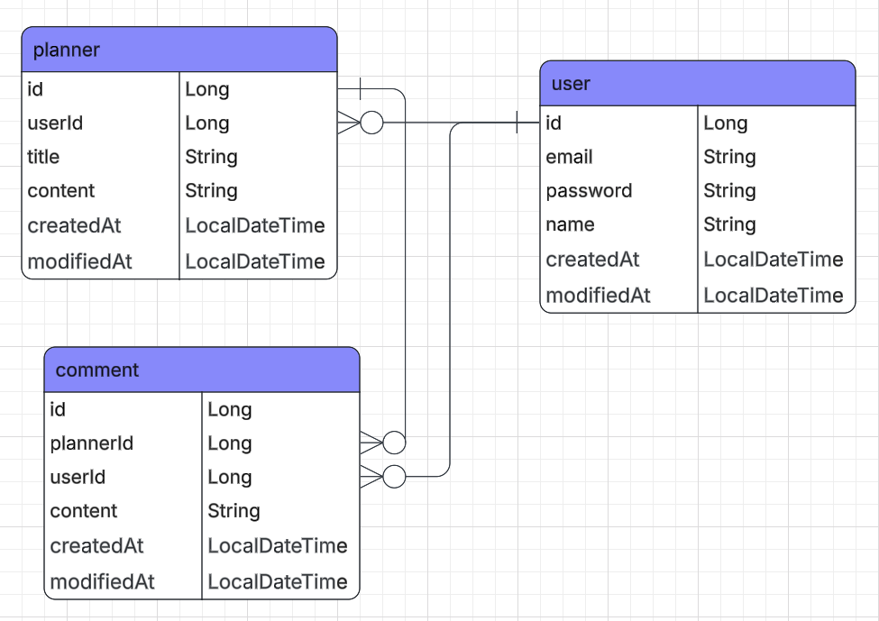

# API Documents
## Planner2

POST  
create planner  
http://localhost:8080/planners  

GET  
get planner  
http://localhost:8080/planners/:plannerId  
Path Variables  
plannerId  

GET  
get planner list  
http://localhost:8080/planners  

PATCH  
update planner  
http://localhost:8080/planners/:plannerId  
Path Variables  
plannerId  

DELETE  
delete planner  
http://localhost:8080/planners/:plannerId  
Path Variables  
plannerId  

POST  
create user  
http://localhost:8080/users  

GET  
get user  
http://localhost:8080/users/:userId  
Path Variables  
userId  

GET  
get user list  
http://localhost:8080/users  

PATCH  
update user  
http://localhost:8080/users/:userId  
Path Variables  
userId  

DELETE  
delete user  
http://localhost:8080/users/:userId  
Path Variables  
userId  

POST  
create comment  
http://localhost:8080/planners/:plannerId  
Path Variables  
plannerId  

GET  
get comment  
http://localhost:8080/planners/:plannerId/comment/:commentId  
Path Variables  
plannerId  
commentId  

GET  
get comment list  
http://localhost:8080/planners/:plannerId/comment  
Path Variables  
plannerId  

PATCH  
update comment  
http://localhost:8080/planners/:plannerId/comment/:commentId  
Path Variables  
plannerId  
commentId  

DELETE  
delete comment  
http://localhost:8080/planners/:plannerId/comment/:commentId  
Path Variables  
plannerId  
commentId  

# ERD
